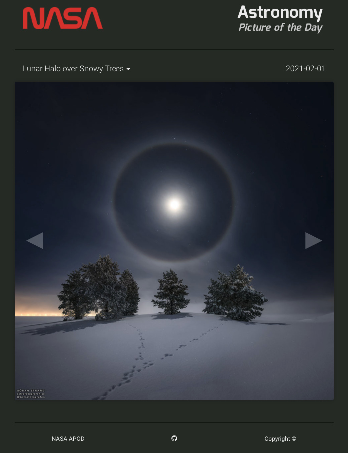

# Browser App for NASA's Astronomy Photo of the Day

This is a simple, single-page-application to display [NASA's astronomy photo of the day](https://apod.nasa.gov/apod/astropix.html) and browse previous days.

**[Link to live app](https://nasa-apod-site.netlify.app/)**

## Techonology Stack

- The underlying technologies are JavaScript, HTML and CSS
- The app uses the [React library](https://reactjs.org/) for the frontend architecture
- It leverages [NASA's API](https://api.nasa.gov/) for data related to the astronomy photo of the day
- Dependencies are in [package.json](./package.json) and include [Font Awesome](https://fontawesome.com/), [Styled Components](https://styled-components.com/) and [Axios](https://www.npmjs.com/package/axios)
- The app is hosted by [Netlify](https://www.netlify.com/)

## Developer Instructions

- [ ] Create a forked copy of this project
- [ ] Clone a version to your local repository
- [ ] Download project dependencies by running `npm install` in your terminal
- [ ] Start up the app locally using `npm start`
- [ ] Happy hacking!
- [ ] When you're ready, share it or pull request me

*For feedback or contributions please submit a pull request or DM me*

Thanks for checking it out!